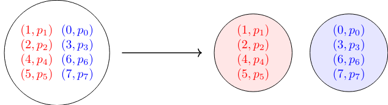
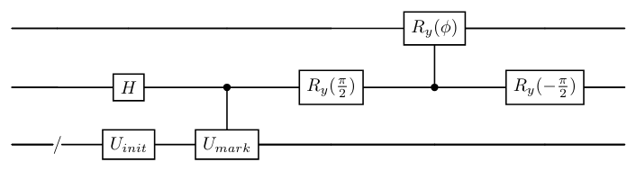



# 🔍 A Brief Tutorial on Grouping Set Elements Through Direct Quantum Search

**Ammar Daskin**  
📄 for PDF version: [http://dx.doi.org/10.13140/RG.2.2.35311.55201](http://dx.doi.org/10.13140/RG.2.2.35311.55201)

## 📝 Abstract  
It is shown that instead of repeating the operators of the Grover search algorithm, one can directly generate the final solution state by using an ancillary qubit. Although the amplitude amplification at the end of the circuit matches the asymptotic complexity of the Grover search algorithm, obtaining the solution state with $O(1)$ operations enables new algorithmic designs in the subspace of a quantum state determined by the value of the ancilla register. This paper briefly explains how this approach can be used to separate a group of elements into disjoint sets, accompanied by explicit circuit diagrams. In addition, it discusses how this approach can enable divide-and-conquer, dynamic programming, and other similar algorithmic techniques on quantum computers.

## 1️⃣ 🌟 Introduction  
Consider a set containing two groups of elements, red 🔴 and blue 🔵, where each element has an associated probability $p_i$. Our goal is to separate these elements into two disjoint sets:

This problem can be formulated for quantum computers by first constructing two quantum states: $$\vec{u}_{init}$$ representing the elements with their probabilities, and $$\vec{u}_{marked}$$ which uses sign differences in the amplitudes to distinguish between element types:

$$
\vec{u}_{init}=\begin{bmatrix}p_0\\p_1\\p_2\\p_4\\p_5\\p_6\\p_7\\\end{bmatrix}\text{ and }\ \vec{u}_{marked}=\begin{bmatrix}{\color{blue}-p_0}\\{\color{red}p_1}\\{\color{red}p_2}\\{\color{blue}-p_3}\\{\color{red}p_4}\\{\color{red}p_5}\\{\color{blue}-p_6}\\{\color{blue}-p_7}\\\end{bmatrix}.
$$

The solution to this problem is then represented by the following two quantum states:

$$
{\color{blue}\vec{s}_{marked}=\begin{bmatrix}p_0\\0\\0\\p_3\\0\\0\\p_6\\p_7\\\end{bmatrix}}\text{ and }{\color{red}\vec{s}_{unmarked}=\begin{bmatrix}0\\p_1\\p_2\\0\\p_4\\p_5\\0\\0\\\end{bmatrix}}.
$$

We construct the quantum state $$\vec{u}_{init}$$ to encode the probability amplitudes of the elements. For example, given a set, we prepare a quantum state representing the likelihood of each element: Consider $2^n$-dimensional vectors $$\vec{u}_{init}$$ and $$\vec{u}_{marked}$$ that differ only in the signs of certain elements, marking their group membership: For $a\in R$ and $a\geq 0.5$, if the following operator [1], $$\mathfrak{C}$$, is applied to a vector horizontally stacked with $$\vec{u}_{init}$$ and $$\vec{u}_{marked}$$ and zero vectors, on the first half of the output we get one group and on the remaining half of the output is the second group elements with higher probabilities:

$$
\underbrace{\frac{1}{a+1}\begin{bmatrix}a&-1&-\sqrt{a}&-\sqrt{a}\\-1&a&-\sqrt{a}&-\sqrt{a}\\\sqrt{a}&\sqrt{a}&a&-1\\\sqrt{a}&\sqrt{a}&-1&a\end{bmatrix}}_{\mathfrak{C}}\otimes I^{\otimes n}\times\begin{bmatrix}\vec{u}_{marked}\\\vec{u}_{init}\\\hline\vec{0}\\\vec{0}\end{bmatrix}=\frac{1}{a+1}\begin{bmatrix}a\vec{u}_{marked}-\vec{u}_{init}\\-\vec{u}_{marked}+au_{init}\\\hline\sqrt{a}(\vec{u}_{marked}+\vec{u}_{init})\\\sqrt{a}(\vec{u}_{marked}+\vec{u}_{init})\end{bmatrix}.
$$

When $a$ is close to 1, this can be used to indicate separate two group of elements by the value of the first ancilla qubit:

$$
\frac{1}{2}\begin{bmatrix}u_{marked}-u_{init}\\-u_{marked}+u_{init}\\\hline(u_{marked}+u_{init})\\(u_{marked}+u_{init})\end{bmatrix}=\frac{1}{2}\begin{bmatrix}\color{blue}-s_{marked}\\\color{blue}s_{marked}\\\hline\color{red}s_{unmarked}\\\color{red}s_{unmarked}\end{bmatrix}
$$

When measuring the first qubit of this quantum state, the outcome $0$ yields elements from one group, while the outcome $1$ yields elements from the second group in the collapsed state. The probability for both groups can be amplified through the amplitude amplification on the ancilla. This approach is given as an alternative implementation [1] to Grover search algorithm [2,4] by implementing the non-linear operation described in Ref.~[3].

**🔢 Separating multiple groups.** Similarly, after marking different groups, we can stack them all together to have a quantum state where ancilla indicates different groups in the set.

$$
\begin{bmatrix}\mathfrak{C}&&&\\&\mathfrak{C}&&\\&&\ddots&\\&&&\mathfrak{C}\\\end{bmatrix}\otimes I^{\otimes n}\times\begin{bmatrix}\vec{u}^{(1)}_{marked}\\\vec{u}_{init}\\\\vec{0}\\\vec{0}\\\\hline\vdots\\\hline\vec{u}^{(k)}_{marked}\\\vec{u}_{init}\\\vec{0}\\\vec{0}\\\end{bmatrix}=\begin{bmatrix}\color{blue}-s^{(1)}_{marked}\\\color{blue}s^{(1)}_{marked}\\\color{red}s^{(1)}_{unmarked}\\\color{red}s^{(1)}_{unmarked}\\\hline\vdots\\\hline\color{blue}-s^{(k)}_{marked}\\\color{blue}s^{(k)}_{marked}\\\color{red}s^{(k)}_{unmarked}\\\color{red}s^{(k)}_{unmarked}\end{bmatrix}\xrightarrow{SWAP}\begin{bmatrix}\color{blue}-s^{(1)}_{marked}\\\color{blue}s^{(1)}_{marked}\\\vdots\\\color{blue}-s^{(k)}_{marked}\\\color{blue}s^{(k)}_{marked}\\\hline\color{red}s^{(1)}_{unmarked}\\\color{red}s^{(1)}_{unmarked}\\\vdots\\\color{red}s^{(k)}_{unmarked}\\\color{red}s^{(k)}_{unmarked}\end{bmatrix}
$$

This quantum state represents the sets in the upper half and their complements (the unmarked elements) in the second half. Note that instead of the same $$\vec{u}_{init}$$, one can use different $$\vec{u}_{init}$$ in a similar fashion to operate on different sets.

## 2️⃣ ⚛️ Quantum Circuit Implementation of $\mathfrak{C}$
*Explicit circuit implementation of $\mathfrak{C}$, where $R_y$ denotes the standard Y-rotation gate. The parameter $\phi$ depends on $a$: when $$a=1$$, $$\phi=\pi$$; for other values, $\phi$ is chosen to satisfy $$R_y(\phi)=\begin{bmatrix}\frac{a-1}{a+1}&-\frac{2\sqrt{a}}{a+1}\\\frac{2\sqrt{a}}{a+1}&\frac{a-1}{a+1}\end{bmatrix}$$.*

We begin by defining the cosine ($C$) and sine ($S$) matrices:

$$
C=\frac{1}{a+1}\begin{bmatrix}a&-1\\-1&a\end{bmatrix}\text{ and }S=\frac{\sqrt{a}}{a+1}\begin{bmatrix}1&1\\1&1\end{bmatrix}.
$$

The unitary operator $\mathfrak{C}$ can then be expressed in cosine-sine form as:  

$$
\mathfrak{C}=\frac{1}{a+1}\begin{bmatrix}a&-1&-\sqrt{a}&-\sqrt{a}\\-1&a&-\sqrt{a}&-\sqrt{a}\\\sqrt{a}&\sqrt{a}&a&-1\\\sqrt{a}&\sqrt{a}&-1&a\end{bmatrix}=\begin{bmatrix}C&-S\\S&C\end{bmatrix}\text{ with }C^2+S^2=I.
$$

Here, $C^2+S^2=I$ ensures unitarity. The eigenspaces for both matrices are characterized by the Hadamard like matrices with the following decompositions:  

$$
S=\left(\begin{matrix}1&1\\-1&1\end{matrix}\right)\left(\begin{matrix}0&0\\0&\frac{\sqrt{a}}{a+1}\end{matrix}\right)\left(\begin{matrix}1&-1\\1&1\end{matrix}\right)=\frac{1}{a+1}\left(\begin{matrix}\sqrt{a}&\sqrt{a}\\\sqrt{a}&\sqrt{a}\end{matrix}\right).
$$

$$
\begin{split}
C=&\frac{1}{2(a+1)}\left(\begin{matrix}1&1\\-1&1\end{matrix}\right)\left(\begin{matrix}a+1&0\\0&a-1\end{matrix}\right)\left(\begin{matrix}1&-1\\1&1\end{matrix}\right)\\=&\frac{1}{2(a+1)}\left(\begin{matrix}a+1&a-1\\-(a+1)&a-1\end{matrix}\right)\left(\begin{matrix}1&-1\\1&1\end{matrix}\right)\\=&\frac{1}{a+1}\left(\begin{matrix}a&-1\\-1&a\end{matrix}\right).
\end{split}
$$

More specifically, for the quantum gate 

   $$
   V=\frac{1}{\sqrt{2}}\begin{bmatrix}1&1\\-1&1\end{bmatrix};
   $$

the eigendecompositions can be finalized as:

$$
C=VD_CV^T,\quad S=VD_SV^T,
$$

with 

$$
D_C=\begin{bmatrix}1&0\\0&\frac{a-1}{a+1}\end{bmatrix},\quad D_S=\begin{bmatrix}0&0\\0&\frac{2\sqrt{a}}{a+1}\end{bmatrix}.
$$

Therefore, $\mathfrak{C}$ can be factorized into:

$$
\mathfrak{C}=(I_2\otimes V)\cdot\mathcal{D}\cdot(I_2\otimes V^T),
$$

where $\mathcal{D}$ is a block-diagonal matrix:

$$
\mathcal{D}=\begin{bmatrix}D_C&-D_S\\D_S&D_C\end{bmatrix}.
$$

We leverage the cosine-sine decomposition and eigendecompositions of $C$ and $S$ to construct a quantum circuit for the operator $\mathfrak{C}$. In the basis defined by $V^T$, $\mathcal{D}$ simplifies to the following:
- When the second qubit is $1$, to the first qubit, apply the following gate: 

$$
R=\begin{bmatrix}\frac{a-1}{a+1}&-\frac{2\sqrt{a}}{a+1}\\\frac{2\sqrt{a}}{a+1}&\frac{a-1}{a+1}\end{bmatrix}.
$$

- When the second qubit (in the eigenbasis) is $0$, do nothing or apply $I$ to the first qubit.

Therefore, the whole quantum circuit is defined as the sequence requiring only 3 operations:
1. 🔄 Applying $V^T=R_y(90^\circ)=R_y(\pi/2)$ gate to the second qubit in order to change the basis.
2. ⚙️ Applying the following rotation gate:

   $$
   R=R_y(\phi)=\begin{bmatrix}\frac{a-1}{a+1}&-\frac{2\sqrt{a}}{a+1}\\\frac{2\sqrt{a}}{a+1}&\frac{a-1}{a+1}\end{bmatrix}\quad\text{where}\quad\cos(\phi/2)=\frac{a-1}{a+1},\quad\sin(\phi/2)=\frac{2\sqrt{a}}{a+1}.
   $$
   - For $a=1$:

   $$
   \cos(\phi/2)=\frac{1-1}{1+1}=0,\quad\sin(\phi/2)=\frac{2\sqrt{1}}{1+1}=1\implies\phi/2=\pi/2,\quad\phi=\pi.
   $$

Thus, $R_y(\pi)=\begin{bmatrix}0&-1\\ 1&0\end{bmatrix}$ (a Pauli-Y rotation up to phase).

1. 🔄 Applying $V=R_y(-90^\circ)=R_y(-\pi/2)$ gate to the second qubit reverts the basis back.

By combining the circuit for $\mathfrak{C}$ with the initial state preparation and marking operation, we can define the whole framework as in the following figure.

*The whole direct search circuit without amplitude amplification. The amplitude amplification can be applied by marking the desired set on the ancilla.*

## 3️⃣ ⏱️ Complexity Analysis  
The whole circuit given in the figure requires $O(n)$ quantum operations if the marking circuit $U_{mark}$ (which is generally implemented through a controlled-Z gate along with a function output) and $U_{init}$ the state preparation operation (Hadamard gates for an equal superposition state) are in $O(n)$. The operator $\mathfrak{C}$ requires only 3 gates per qubit pair.  

At the end, the probabilities can be amplified by using amplitude amplification algorithm. If the amplification is only for a single element, this would take $O(\sqrt{2^n})$.  

## 4️⃣ 💡 Discussion  
In addition to providing square-root speedup over classical algorithms for unstructured search as in the Grover search algorithm [2,4], the approach can be used in more general framework for grouping elements or disregarding some part of the solution space of a problem. Classically grouping set elements requires traversing all elements at least once, resulting in $O(2^n)$ complexity.  

Many set membership based algorithms and structures such as union-find data structures for determining disjoint sets can be implemented by using the approach described in this paper. In addition, many algorithmic design principles such as divide and conquer, greedy, dynamic programming, back propagation for solving problems are based on partitioning a too large problem into smaller subproblems. Therefore, the direct quantum grouping method provides a framework that not only achieves square-root speedup over classical algorithms for preparing disjoint sets but also enables quantum versions of classical algorithmic primitives by preparing grouped states in $\mathcal{O}(1)$ operations using the $\mathfrak{C}$ operator:  

- **🧩 Divide-and-Conquer:** Problems are partitioned into subgroups indexed by ancilla qubits. Each subgroup can be processed independently in superposition (e.g., recursive quantum algorithms).  
- **📊 Dynamic Programming:** Overlapping subproblems can be stored as quantum states in grouped registers and solutions can be combined via controlled operations (potentially using additional ancilla qubits).  
- **🔄 Set Manipulation:** Union-find operations and clustering achieve $\mathcal{O}(\sqrt{N})$ speedups via amplitude amplification.  
- **⚡ Generic optimization:** Low-value solution subspaces can be discarded through ancilla measurements, focusing computation on higher-probability regions. Based on some greedy strategy, subsets can be iteratively selected for marking by ancilla measurements in order to reach a global subset of a solution.  
- **🤖 Prediction head for machine learning:** For example, in quantum machine learning, data classes separated by $\mathfrak{C}$ can be classified into different disjoint sets. By adjusting the value of $a$, the set membership can be determined by low-high level probabilities.  

## 5️⃣ 🎯 Conclusion  
In this paper, a direct quantum search approach based on [1] is explained for partitioning sets into disjoint groups using the unitary operator $\mathfrak{C}$. Since solution states are prepared in $\mathcal{O}(1)$ operations, it can provide certain advantages in the algorithmic design over the standard implementation of Grover search algorithm. Since the groups are indexed by ancilla qubits, it enables hierarchical direct processing that can facilitate further quantum algorithmic designs based on classical algorithm design paradigms such as dynamic programming, and divide and conquer. Since the circuit for $\mathfrak{C}$ is gate-efficient and compatible with amplitude amplification, it can be directly used along with the amplitude amplification. The framework is general and can provide a foundation to explore hybrid quantum-classical implementations for large-scale set operations.  

## 📚 References    
[1] Ammar Daskin. An alternative explicit circuit diagram for the quantum search algorithm by implementing a non-unitary gate. arXiv preprint arXiv:2412.16514, 2024.    
[2] Lov K Grover. A fast quantum mechanical algorithm for database search. In Proceedings of the twenty-eighth annual ACM symposium on Theory of computing, pages 212–219, 1996.    
[3] Daniel S Abrams and Seth Lloyd. Nonlinear quantum mechanics implies polynomial-time solution for np-complete and# p problems. Physical Review Letters, 81(18):3992, 1998.    
[4] Lov K Grover. Quantum computers can search arbitrarily large databases by a single query. Physical review letters, 79(23):4709, 1997.  

*Note that emojis and some grammar corrections are made by using DeepSeek-R1*

## 🖋️ Citation    
- Ammar Daskin. A brief tutorial on grouping set elements through direct quantum search. 2025 ResearchGate preprint [http://dx.doi.org/10.13140/RG.2.2.35311.55201](http://dx.doi.org/10.13140/RG.2.2.35311.55201)   
 
- Ammar Daskin. An alternative explicit circuit diagram for the quantum search algorithm by implementing a non-unitary gate. arXiv preprint [arXiv:2412.16514](https://arxiv.org/abs/2412.16514), 2024.

